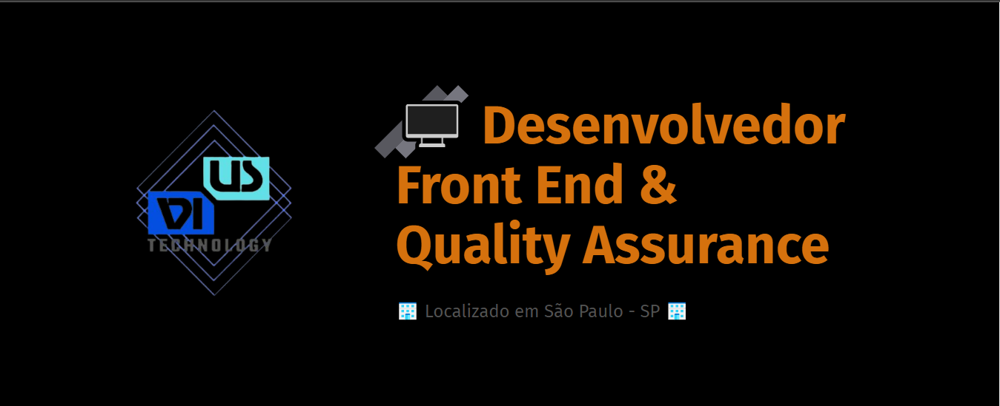

<h1>Portfólio VIUS Dev</h1>

<strong>Sobre</strong>

Projeto pessoal feito ao longo do curso da <a href="https://www.origamid.com/curso/html-e-css-para-iniciantes" target="_blank">Origamid.</a>

  A <strong><a href="https://santosvini.github.io/" target="_blank">VIUS</a> é meu site e portfólio, como forma de uso para minha presença digital, para compartilhar meu curriculo e experiências de forma prática, moderna e acessível, e há o arquivo como opção de download.
  
  O site está totalmente de forma responsiva :iphone: em todas as sections, feito em sua totalidade com HTML5 e CSS3.

  Criei o botão de dark mode para efeitos visuais e uma nova experiência de acesso e usabilidade. :computer:
  
  Caso tenha curtido, se gostou os links estão disponíveis para acesso e sinta-se a vontade para sugestões e melhorias :wave:.

